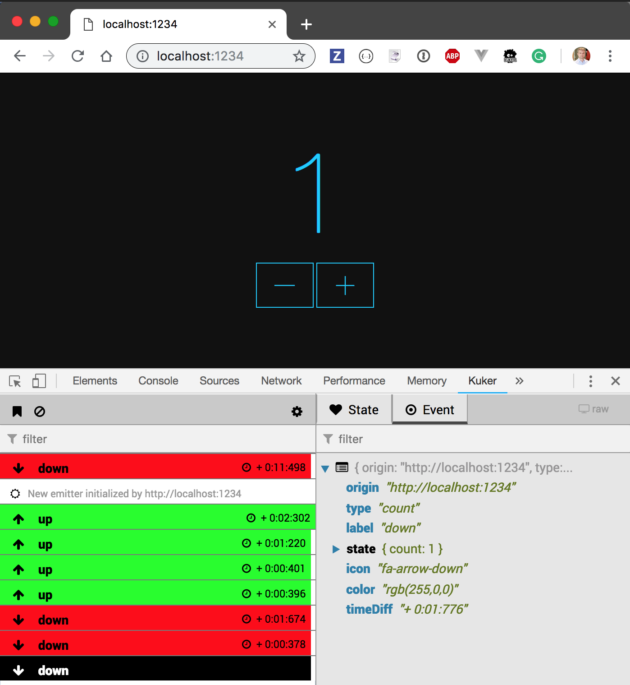
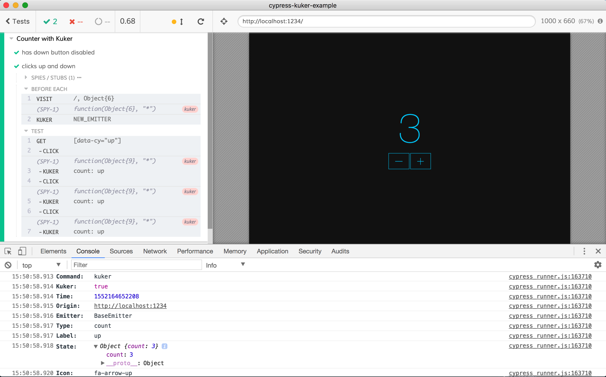

# cypress-kuker-example 

> Cypress.io plus Kuler.js example

## Use

- clone repo
- install dependencies with `npm install`
- `npm start`
- open `localhost:1234` in the browser

If you have Kuker DevTools extension installed, you should see events when you click "-" or "+" buttons.

## Cypress test

## Links

- [Kuker.js](https://github.com/krasimir/kuker)
- [Cypress.io](https://www.cypress.io)
